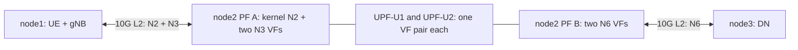

# Two UPF-U workers on CloudLab with Intel 82599 SR-IOV

For the implementation rationale and file references across both repositories,
see the [UPF scaling change summary](changes/README.md).

This guide adapts the original three-node Fabric deployment to CloudLab:
node1 runs UE/gNB, node2 runs ONVM and the control NFs, and node3 runs the DN.
The application can use the same Linux build and NF configuration workflow.
CloudLab provisioning, PF/VF ownership and routing replace the Fabric-specific
steps. Use Bash for shell commands and the actual allocated interface names.

An Intel X520/82599 provides the required SR-IOV functionality; this model does
not require a programmable SmartNIC. What matters is access to two suitable
PFs, their VF configuration and working IOMMU groups. The guide targets bare
metal nodes with those capabilities. [DPDK Intel VF support](https://doc.dpdk.org/guides-24.07/nics/intel_vf.html)

Each worker directly polls queue 0 of one N3 VF and one N6 VF. The manager
initializes all four VFs but skips their packet RX/TX. UPF-C assigns sessions
in worker-list order and returns that worker's static N3 IP and uplink TEID.
Control NFs continue using their existing ONVM transport.

| Session | Worker service | N3 VF | N6 VF | N3 IP (example) | UL TEID |
| --- | --- | --- | --- | --- | --- |
| First: UE1, `10.60.0.1` | 14 | N3 PF VF0 | N6 PF VF0 | `192.168.2.11` | `0x1001` (4097) |
| Second: UE2, `10.60.0.2` | 15 | N3 PF VF1 | N6 PF VF1 | `192.168.2.12` | `0x1002` (4098) |

Use one IPv4 PDU session and one default UL/DL PDR pair per UE, with NAT
disabled. Connect UE1 before UE2. Worker selection uses arrival order, not a
configured UE-IP allowlist; the preinstalled NIC rules must match that order.
Assignments are not reused. Restart the full application between experiments.

## 0. Migrate the Fabric provisioning and tutorial

The references reviewed are [the original notebook](../../old_ref/original_setup/l25gc-main-dummy-latest.ipynb)
and [the original tutorial](../../old_ref/original_setup/knit-tutorial.md).
They remain reference material. Notebook cell numbers below are zero-based
positions in its `cells` array; use the section titles when viewing Jupyter.

| Original step | CloudLab/SR-IOV replacement |
| --- | --- |
| Notebook cells 1–13: Fablib, `NIC_Basic`, slice creation | Allocate three bare metal nodes and two experiment links as below. Use CloudLab SSH/manifest information. |
| Cell 8: topology | Its active code calls `add_l3network()`; the L2 calls are commented out. Use direct L2 experiment links for N3/N6 so VF MAC delivery and UPF-U's ARP work. |
| Cells 17, 27, 38, 46: clone and `setup.sh cn/ue/dn` | Retain the role-specific Linux setup through SSH; deploy the scaling checkout and patched SMF after the baseline installer. |
| Cell 19: `install_ofed.sh` | Skip it on Intel. Keep PFs on Linux `ixgbe`; bind only the four CN VFs to `vfio-pci`. |
| Cells 21–25: addresses/connectivity | Retain the three IP subnets, but N2 shares the first physical experiment link with N3. CN worker IPs live in UPF-U YAML; CN's kernel owns the N2 address. |
| Cell 30: PCI/DPDK port table | Derive VF BDFs from each PF's `virtfnN`, then read actual port IDs from manager startup. `dpdk-devbind.py` list order is not a DPDK port-ID contract. |
| Cells 32, 34, 36: AMF, SMF, single UPF-U | Set the new N2 address, retain one UPF-C in SMF, and generate two worker configs. Patched SMF receives per-session N3 endpoints through PFCP. |
| Cell 40: UE/RAN host route to DN via one N3 IP | Omit it for UE traffic. Use the UE TUN interfaces and source-based routing in step 8. |
| Cell 48: DN route for the entire UE subnet via one N6 IP | For a kernel DN, install two UE `/32` routes, each through its worker's N6 IP. A MAC-swapping reflector uses its existing return path. |
| Tutorial subscriber/NF/UERANSIM steps | Keep them, with two subscribers, two UPF-Us, distinct static UE IPs and five CN terminals. |
| Notebook cell 44 / tutorial OAI handover section | Skip for this connect-once experiment. Start with UERANSIM; the handover procedure is outside the implemented model. |

### CloudLab nodes and physical topology

Choose a Wisconsin node type whose **two experiment ports** are Intel X520:
the hardware catalog lists `c220g1`, `c220g2` and `c220g5` with this arrangement.
Availability and the allocated hardware must still be checked. An arbitrary
Intel NIC may need another PF driver and different filter commands.
[CloudLab hardware catalog](https://docs.cloudlab.us/hardware.html)

Use two 10-Gbit/s experiment links. On node2, the first PF carries kernel N2
traffic to its PF MAC and N3 traffic to its two VF MACs. Its PF remains under
`ixgbe`, so AMF can use it while UPF-U polls the VFs. The second PF supplies
the two N6 VFs. This preserves the three logical IP subnets using two physical
ports; N2 does not need a third data NIC.



Keep SSH, package downloads and WebConsole access on CloudLab's separate
management/control interface. N2 is 5G control traffic, but it still belongs
on the **experiment** network. CloudLab distinguishes these networks and
provides switch counters useful for kernel-bypass traffic.
[CloudLab network guidance](https://docs.cloudlab.us/control-net.html)

Create a Python CloudLab profile along these lines. Replace `OS_IMAGE` with
the Ubuntu 22.04 image URN selected in the portal; retain that baseline OS
for the first run. This script belongs in the CloudLab profile editor:

```python
import geni.portal as portal
import geni.rspec.pg as pg

OS_IMAGE = "<Ubuntu 22.04 image URN from the CloudLab image picker>"
request = portal.context.makeRequestRSpec()
nodes = {}
for name in ("ueran", "cn", "dn"):
    node = request.RawPC(name)
    node.hardware_type = "c220g2"
    node.disk_image = OS_IMAGE
    nodes[name] = node

ran = nodes["ueran"].addInterface("n2n3")
cn_access = nodes["cn"].addInterface("n2n3")
cn_core = nodes["cn"].addInterface("n6")
dn = nodes["dn"].addInterface("n6")
ran.addAddress(pg.IPv4Address("192.168.1.1", "255.255.255.0"))
cn_access.addAddress(pg.IPv4Address("192.168.1.2", "255.255.255.0"))
# This PF address is for initial link checks; workers use .11 and .12.
cn_core.addAddress(pg.IPv4Address("192.168.3.1", "255.255.255.0"))
dn.addAddress(pg.IPv4Address("192.168.3.2", "255.255.255.0"))
for name, members in (("n2n3", [ran, cn_access]), ("n6", [cn_core, dn])):
    link = request.Link(name, members=members)
    link.bandwidth = 10_000_000  # Kbit/s: request the full 10-Gbit/s link
    link.link_multiplexing = False
    link.vlan_tagging = False   # untagged Ethernet at the hosts
portal.context.printRequestRSpec()
```

These are `RawPC` allocations with separate interfaces, not virtual links
multiplexed onto one NIC. The testbed can use VLANs inside its switches;
`vlan_tagging=False` requests untagged host interfaces. No software bridge,
traffic shaper or inter-node tunnel is needed for this topology.
[CloudLab profile API](https://docs.cloudlab.us/geni-lib.html),
[link/interface API](https://docs.cloudlab.us/geni-lib/api/genirspec/pg.html)

Instantiate all three nodes at the same site. In the manifest, map each
requested interface's MAC to the Linux device reported by `ip -br link`.
Do not assume `ens1f0`/`ens1f1` or PCI order. Check `ethtool -i` and `ethtool`
for the selected devices; node2 needs `ixgbe` and a 10000-Mb/s link on each.
`geni-get manifest` and `geni-get control_mac` can identify the experiment
interfaces and the management interface to leave alone.
[CloudLab introspection](https://docs.cloudlab.us/advanced-topics.html)

| Address | Owner in this example |
| --- | --- |
| `192.168.1.1/24` | node1 kernel N2, on its `n2n3` link |
| `192.168.1.2/24` | node2 kernel N2/AMF, on PF A |
| `192.168.2.1/24` | node1 kernel N3/gNB, added to the same device |
| `192.168.2.11`, `.12` | worker 1/2 N3 IPs, in UPF-U YAML |
| `192.168.3.11`, `.12` | worker 1/2 N6 IPs, in UPF-U YAML |
| `192.168.3.2/24` | node3 DN endpoint |
| `192.168.3.1/24` | node2 kernel N6 PF, diagnostic address only |

On node1, add its N3 address to the actual `n2n3` device and check N2:

```bash
N3_LINK=ens1f0  # replace using the manifest/MAC mapping
sudo ip address replace 192.168.2.1/24 dev "$N3_LINK"
sudo ip link set dev "$N3_LINK" up
ping -c 3 -I "$N3_LINK" 192.168.1.2
```

On node3, before starting a userspace reflector, verify the N6 physical link
with `ping -c 3 192.168.3.1`. These checks test the kernel PF path; they do not
yet verify worker VFs. Reapply manually added addresses after a reboot.

## 1. Record the testbed values

On node2, create an environment file for the following terminals:

```bash
mkdir -p "$HOME/upf-sriov-demo"
cat > "$HOME/upf-sriov-demo/env.sh" <<'EOF'
export UPF_REPO="$HOME/L25GC-plus/NFs/onvm-upf"
export DEMO_DIR="$HOME/upf-sriov-demo"
export N3_PF=ens1f0
export N6_PF=ens1f1
export CN_N2_IP=192.168.1.2
export N3_IP1=192.168.2.11
export N3_IP2=192.168.2.12
export N6_IP1=192.168.3.11
export N6_IP2=192.168.3.12
export GNB_N3_IP=192.168.2.1
export DN_IP=192.168.3.2
export UE1_IP=10.60.0.1
export UE2_IP=10.60.0.2
export N3_VF0_MAC=02:00:00:03:00:01
export N3_VF1_MAC=02:00:00:03:00:02
export N6_VF0_MAC=02:00:00:06:00:01
export N6_VF1_MAC=02:00:00:06:00:02
EOF
# Edit these values before continuing.
source "$HOME/upf-sriov-demo/env.sh"
```

Use distinct, reachable N3 addresses and distinct N6 addresses for the workers.
These addresses belong to UPF-U's packet/ARP handling; do not also assign them
to node2's Linux PF interfaces. Keep `CN_N2_IP` on the Linux N3 PF for AMF.
The N6 PF diagnostic address is not a worker gateway. Configure the two static
UE IPs as described in step 2; `dnn_list.cidr` alone does not assign them.

The commands below use manager cores 0–2, UPF-U1 core 3, UPF-C core 4 and
UPF-U2 core 14, leaving cores 5–13 for the baseline control-NF launch script.
Check `lscpu -e` and the other NFs' actual bindings for conflicts; the example
mask assumes logical CPUs 0–15 are available.
Services 14 and 15 must be unused, with exactly one worker per service/VF pair.

## 2. Build ONVM/UPF and apply the one SMF change

### Install the baseline software on the new nodes

Reuse the shell commands inside the notebook's `node.execute()` calls over
CloudLab SSH. The Fablib objects and Fabric bastion configuration are not used.
On each fresh node, clone the same L25GC baseline revision used in your Fabric
run, rather than silently moving the experiment to a different upstream version:

```bash
cd "$HOME"
git clone https://github.com/nycu-ucr/L25GC-plus.git
cd L25GC-plus
# Check out your recorded baseline revision here before running its installer.
```

Run **only the matching role** on each node:

```bash
# node2 / CN
cd "$HOME/L25GC-plus"
./scripts/setup.sh cn
```

```bash
# node1 / UE-RAN
cd "$HOME/L25GC-plus"
./scripts/setup.sh ue
```

```bash
# node3 / DN (kernel ping/iperf support)
cd "$HOME/L25GC-plus"
./scripts/setup.sh dn
```

Skip the notebook's separate `install_ofed.sh` command. Preserve the baseline
X-IO/module-cache integration, MongoDB/WebConsole and control-NF build steps.
The baseline installer may build/load `igb_uio`; that does not select the
driver for this experiment. Explicitly bind the CN VFs to `vfio-pci` in step 3.

After initial installation, deploy this scaling checkout at
`$HOME/L25GC-plus/NFs/onvm-upf`, retaining the installed DPDK dependencies.
Do not rerun a parent-repo submodule reset/update that replaces it with the old
single-worker revision. Apply the SMF patch below and rebuild the actual
binaries used by the launch scripts. Check available space on the mounted
build filesystem before installing.

### Rebuild the changed UPF and SMF

On node2, retain the working L25GC build environment and installed DPDK
24.07, including the ixgbe PMD. For a fresh environment, use
[the dependency/build instructions](../../MANUAL_INSTALL.md); this experiment
uses `vfio-pci` for VFs instead of the legacy PF/`igb_uio` binding steps.
`ethtool`, `iproute2`, `pciutils` and `bc` are also needed.

```bash
source "$HOME/upf-sriov-demo/env.sh"
cd "$UPF_REPO"
pkg-config --modversion libdpdk
# Activate the existing Meson/Python environment here if your baseline uses one.
if [ -d build/meson-private ]; then
    meson setup --reconfigure build
else
    meson setup build
fi
ninja -C build onvm/logger/liblogger.a
ninja -C build
sudo ldconfig
```

Rebuild manager, UPF-C and UPF-U together: the shared session layout changed.
Do not run old UPF binaries against the new manager/session state.

The companion SMF change is the single commit `9d572b9`, based on `7ee2243`.
Its exact diff is included as [smf-n3-allocation.patch](smf-n3-allocation.patch)
so deployment does not depend on the local `old_ref/` checkout.
From a clean checkout of the matching deployed SMF baseline:

```bash
cd "$HOME/L25GC-plus/NFs/smf"
git status --short
git apply --check "$UPF_REPO/docs/sriov-upf/smf-n3-allocation.patch"
git am "$UPF_REPO/docs/sriov-upf/smf-n3-allocation.patch"
CGO_ENABLED=1 go build -o "$HOME/L25GC-plus/bin/smf" ./cmd
```

Skip `git am` if that SMF change is already applied. Keep the baseline X-IO
replacement, CGO include/link settings and ONVM poller configuration; a plain
upstream SMF environment does not provide this deployment's control transport.

The patch records UPF-C's FTUP capability, requests `CH=1`, consumes the returned
Created PDR and uses its N3 IP/TEID in the N2 setup sent to the gNB. It retains
SMF's local TEID allocator bookkeeping and the gNB-assigned downlink TEID.
Allocation mode advertises one uplink tunnel; no NR-DC setup is required.

Keep **one UPF-C node** in `smfcfg.yaml`, with its existing N4 address and DNN.
Keep the existing valid N3 `interfaces.endpoints` configuration; the patched
SMF uses the returned per-session endpoint for N2 instead of that common
placeholder (use `192.168.2.11` here). Do not add two UPF nodes to SMF.
Set AMF `configuration.ngapIpList` to `[192.168.1.2]`, the node2 kernel N2
address. The notebook's AMF/SMF config edits can be reused with these values;
no AMF code change is needed.

### Configure two subscribers and the gNB

Reuse the tutorial WebConsole procedure. Start it on node2 with
`cd ~/L25GC-plus/webconsole && ./bin/webconsole`; from your laptop, use
CloudLab's SSH username/hostname/key to forward the port:

```bash
ssh -N -L 5000:127.0.0.1:5000 CLOUDLAB_USER@CN_SSH_HOST
```

Create two distinct SUPIs/IMSIs and matching UE authentication configs. Use
one DNN (`internet`) and one matching S-NSSAI for this demo. Follow the
tutorial's removal of additional subscriber flow rules, so each session has
one default UL/DL PDR pair. MongoDB must be running before provisioning or
starting the control NFs.

The notebook does not configure fixed subscriber IPs. Set the subscriber's
session-management data at `dnnConfigurations.internet.staticIpAddress` to
`[{"ipv4Addr":"10.60.0.1"}]` for UE1 and
`[{"ipv4Addr":"10.60.0.2"}]` for UE2, using your subscription provisioning
tool (or the WebConsole field if exposed). SMF already consumes this field
in [AllocUeIP()](../../old_ref/smf/internal/context/sm_context.go).
In the single UPF's active S-NSSAI/DNN entry in `smfcfg.yaml`, use matching
pools, for example:

```yaml
# Under userplaneInformation.upNodes.UPF.sNssaiUpfInfos[*].dnnUpfInfoList
- dnn: internet
  pools:
    - cidr: 10.60.1.0/24
  staticPools:
    - cidr: 10.60.0.0/24
```

The pool permits the addresses; the subscriber data selects each address.
Do not assume that a fresh dynamic pool will always assign `.1` and `.2` to
the intended UEs. Confirm both allocated addresses before sending traffic.

In node1's `UERANSIM/config/free5gc-gnb.yaml`, reuse the notebook's edits:

```yaml
ngapIp: 192.168.1.1
gtpIp: 192.168.2.1
amfConfigs:
  - address: 192.168.1.2
    port: 38412
```

Preserve the matching PLMN/TAC/S-NSSAI and local radio-simulator settings.
Prepare `free5gc-ue1.yaml` and `free5gc-ue2.yaml` from the baseline UE config,
with different `supi` values and credentials matching their subscribers.
Configure one IPv4 `internet` session each. Keep the baseline gNB search/link
address reachable locally on node1.

## 3. Create and bind four VFs on node2

Stop the UEs and all existing ONVM NFs/manager before reconfiguring the NIC.
Both physical functions must be available on bare metal node2 with SR-IOV
and IOMMU enabled. A VM allocation does not establish this requirement merely
by exposing an Intel interface; use the physical-node profile in step 0.

```bash
ethtool -i "$N3_PF"
ethtool -i "$N6_PF"
cat "/sys/class/net/$N3_PF/device/sriov_totalvfs"
cat "/sys/class/net/$N6_PF/device/sriov_totalvfs"
cat /proc/cmdline
```

Both PF drivers should be `ixgbe`, and each PF must support at least two VFs.
If IOMMU support is missing, enable it in firmware/boot settings before
continuing. On an Intel/Ubuntu node, add `intel_iommu=on iommu=pt` to the
existing `GRUB_CMDLINE_LINUX_DEFAULT` in `/etc/default/grub`, preserving its
other arguments; run `sudo update-grub`, reboot and reconnect. This also
requires firmware VT-d/SR-IOV support. Verify VF groups below after boot;
do not substitute VFIO's no-IOMMU mode for this setup.

On a fresh setup with `sriov_numvfs` currently zero:

```bash
echo 2 | sudo tee "/sys/class/net/$N3_PF/device/sriov_numvfs"
echo 2 | sudo tee "/sys/class/net/$N6_PF/device/sriov_numvfs"

sudo ip link set dev "$N3_PF" vf 0 mac "$N3_VF0_MAC"
sudo ip link set dev "$N3_PF" vf 1 mac "$N3_VF1_MAC"
sudo ip link set dev "$N6_PF" vf 0 mac "$N6_VF0_MAC"
sudo ip link set dev "$N6_PF" vf 1 mac "$N6_VF1_MAC"
sudo ip link set dev "$N3_PF" up
sudo ip link set dev "$N6_PF" up

N3_VF0_BDF=$(basename "$(readlink -f "/sys/class/net/$N3_PF/device/virtfn0")")
N3_VF1_BDF=$(basename "$(readlink -f "/sys/class/net/$N3_PF/device/virtfn1")")
N6_VF0_BDF=$(basename "$(readlink -f "/sys/class/net/$N6_PF/device/virtfn0")")
N6_VF1_BDF=$(basename "$(readlink -f "/sys/class/net/$N6_PF/device/virtfn1")")
export ONVM_ALLOW_LIST="$N3_VF0_BDF $N6_VF0_BDF $N3_VF1_BDF $N6_VF1_BDF"
for dev in $ONVM_ALLOW_LIST; do
    test -d "/sys/bus/pci/devices/$dev/iommu_group" || { echo "No IOMMU group: $dev"; exit 1; }
    ls "/sys/bus/pci/devices/$dev/iommu_group/devices"
done

sudo modprobe vfio-pci
sudo python3 "$UPF_REPO/subprojects/dpdk/usertools/dpdk-devbind.py" \
    --bind=vfio-pci $ONVM_ALLOW_LIST
sudo python3 "$UPF_REPO/subprojects/dpdk/usertools/dpdk-devbind.py" --status
printf '\nexport ONVM_ALLOW_LIST="%s"\n' "$ONVM_ALLOW_LIST" >> "$DEMO_DIR/env.sh"
```

If there are already two VFs per PF, reuse them and skip writing
`sriov_numvfs`. Check the four BDFs before binding; bind only those VFs.
Their IOMMU groups must be usable without binding the kernel-owned PFs or
management NIC to VFIO. A group containing those devices needs a different
hardware/firmware allocation, not additional PF binding.
Inspect `ip -d link show "$N3_PF"` and its N6 equivalent for assigned MACs and
VLANs. The CloudLab profile requests untagged host links; leave VF VLANs
untagged as well. If the allocated Linux device is a VLAN subinterface,
resolve the profile/interface mismatch before using it as a PF. The ONVM
PCI allowlist takes VF BDFs, never Linux VLAN interface names.

The PFs stay on Linux `ixgbe` to service VF mailbox requests and install
filters. `vfio-pci` exposes the VFs to DPDK's ixgbe VF PMD. VF BDF numbering
can interleave between the two ports; derive it through `virtfnN`, as above.
[DPDK 24.07 Intel VF guide](https://doc.dpdk.org/guides-24.07/nics/intel_vf.html)

## 4. Install the static NIC rules and arrange MAC delivery

Install these rules while the applications are stopped:

```bash
sudo ethtool -K "$N3_PF" ntuple on
sudo ethtool -N "$N3_PF" flow-type udp4 dst-ip "$N3_IP1" dst-port 2152 vf 0 queue 0 loc 0
sudo ethtool -N "$N3_PF" flow-type udp4 dst-ip "$N3_IP2" dst-port 2152 vf 1 queue 0 loc 1
sudo ethtool -K "$N6_PF" ntuple on
sudo ethtool -N "$N6_PF" flow-type ip4 dst-ip "$UE1_IP" vf 0 queue 0 loc 0
sudo ethtool -N "$N6_PF" flow-type ip4 dst-ip "$UE2_IP" vf 1 queue 0 loc 1
sudo ethtool -n "$N3_PF"
sudo ethtool -n "$N6_PF"
```

Use free rule locations if 0/1 are already occupied. Filters on a PF must use
compatible matching masks; inspect existing filters before adding these.
For older ethtool syntax, replace `vf 0 queue 0` with `action 4294967296`, and
`vf 1 queue 0` with `action 8589934592`. Do not use `user-def` as the destination
VF selector. Distinct N3 destination IPs avoid needing GTP/TEID parsing in
the NIC. [Intel ixgbe filter syntax](https://raw.githubusercontent.com/intel/ethernet-linux-ixgbe/main/README),
[Linux v6.8 ixgbe filter implementation](https://raw.githubusercontent.com/torvalds/linux/v6.8/drivers/net/ethernet/intel/ixgbe/ixgbe_ethtool.c)

**82599 Flow Director does not override the VF selected by Ethernet routing.**
Frames must also have the intended VF's destination MAC (or equivalent correct
VLAN/pool delivery). Sending every packet to the PF MAC and adding only the IP
rules above is insufficient. [Intel 82599 datasheet, sections 7.1.2.2 and 7.1.2.7.1](https://www.mouser.com/pdfdocs/82599datasheet.pdf)

On **node1**, use the real gNB N3 interface and the same N3 IP/MAC values:

```bash
# Set these values on node1; N3_LINK may be inside the gNB's network namespace.
N3_LINK=ens1f0
N3_IP1=192.168.2.11
N3_IP2=192.168.2.12
N3_VF0_MAC=02:00:00:03:00:01
N3_VF1_MAC=02:00:00:03:00:02
sudo ip route replace "$N3_IP1/32" dev "$N3_LINK"
sudo ip route replace "$N3_IP2/32" dev "$N3_LINK"
sudo ip neigh replace "$N3_IP1" lladdr "$N3_VF0_MAC" nud permanent dev "$N3_LINK"
sudo ip neigh replace "$N3_IP2" lladdr "$N3_VF1_MAC" nud permanent dev "$N3_LINK"
```

The CloudLab N2/N3 experiment link provides the L2 path between gNB and VFs.
Its kernel N2 traffic continues to use the PF MAC; these two entries select
the N3 VF MACs. A routed topology would instead require correct mappings on
the final hop and suitable ARP behavior.

On **node3**, retain the DN reflector that swaps Ethernet and IP source/
destination addresses. Uplink packets leave with the worker's N6 VF source
MAC; swapping it into the return destination sends the reply to that same VF.
A MAC/IP-only reflector is not an ICMP echo responder or an iperf3 server;
test it with the traffic application designed for that reflector.

For the original tutorial's **kernel ping/iperf DN**, keep node3's N6 port
under its Linux driver with `192.168.3.2/24`. Replace the old route through
one UPF with these more-specific routes and neighbors on node3:

```bash
DN_LINK=ens1f0  # node3 experiment interface from the manifest
sudo ip route replace 10.60.0.1/32 via 192.168.3.11 dev "$DN_LINK"
sudo ip route replace 10.60.0.2/32 via 192.168.3.12 dev "$DN_LINK"
sudo ip neigh replace 192.168.3.11 lladdr 02:00:00:06:00:01 nud permanent dev "$DN_LINK"
sudo ip neigh replace 192.168.3.12 lladdr 02:00:00:06:00:02 nud permanent dev "$DN_LINK"
ip route get 10.60.0.1
ip route get 10.60.0.2
```

Use your configured N6 VF MACs/IPs if different. Do not use the diagnostic
PF address `192.168.3.1` as the UE next hop. The two `/32` routes also cover
TCP ACKs, iperf control traffic and other return packets. Choose one DN mode
per run; a userspace app owning node3's whole NIC cannot simultaneously rely
on that NIC's Linux IP/ARP/iperf stack.

**ARP is still required for outgoing UPF-U traffic.** With NAT off, UPF-U ARPs
directly for the inner DN destination IP and the gNB N3 IP. Both must be L2
reachable or answered by proxy ARP. Ensure the gNB and DN endpoint answer ARP
and that ARP replies can reach each VF. Node2 Linux routes or `ip neigh`
entries do not populate UPF-U's private ARP cache. An IPv4-only DN reflector
must have an ARP responder available on its dataplane link.

## 5. Start the manager and obtain DPDK port IDs

Retain your baseline hugepage allocation and shared-memory setup. For a fresh
dedicated node, a starting allocation is 1024 2-MB pages; increase it if the
manager cannot allocate its pools, and allocate on the NIC's NUMA node:

```bash
echo 1024 | sudo tee /sys/kernel/mm/hugepages/hugepages-2048kB/nr_hugepages
sudo mkdir -p /mnt/huge
mountpoint -q /mnt/huge || sudo mount -t hugetlbfs nodev /mnt/huge
# Retain the baseline's fixed-address multiprocess setup.
sudo sysctl -w kernel.randomize_va_space=0

source "$HOME/upf-sriov-demo/env.sh"
cd "$UPF_REPO"
./scripts/start.sh -k f -D f -n 0xFFF8 -r 32 -s stdout
```

`ONVM_ALLOW_LIST` now contains the **four VF BDFs**, not the original two PFs.
`-k f` initializes DPDK ports 0–3; `-D f` reserves all four for direct I/O.
If using your external manager wrapper, pass `-k f -a "$ONVM_ALLOW_LIST"`
and export `ONVM_DIRECT_PORT_MASK=f` before invoking it.

Stop all previous ONVM processes first: `start.sh` removes old `rtemap_*`
hugepage files. Keep manager/NFs in the same DPDK shared-memory namespace
(default file prefix `rte`). Do not change PF queues, ntuple settings or VF
configuration while the manager/workers run.

Record each startup line `Port N (PCI_BDF): direct NF I/O`, along with
`Rx rings 1` and `Tx rings 1`. **Allowlist order does not establish port ID
order.** In another node2 terminal, substitute the IDs from those lines:

```bash
source "$HOME/upf-sriov-demo/env.sh"
# EXAMPLE ONLY: N3 VF0=0, N3 VF1=1, N6 VF0=2, N6 VF1=3.
cat >> "$DEMO_DIR/env.sh" <<'EOF'
export N3_PORT1=0
export N6_PORT1=2
export N3_PORT2=1
export N6_PORT2=3
EOF
source "$DEMO_DIR/env.sh"
```

## 6. Write the worker and UPF-C configs

On node2, after setting the actual port IDs:

```bash
for worker in 1 2; do
    if [ "$worker" = 1 ]; then
        n3_ip=$N3_IP1; n6_ip=$N6_IP1; n3_port=$N3_PORT1; n6_port=$N6_PORT1
    else
        n3_ip=$N3_IP2; n6_ip=$N6_IP2; n3_port=$N3_PORT2; n6_port=$N6_PORT2
    fi
    cat > "$DEMO_DIR/upf_u_$worker.yaml" <<EOF
info:
  version: 1.0.0
  description: UPF-U worker $worker
configuration:
  log_level: info
  dataplane:
    direct_io: true
    upf_n3_ip: "$n3_ip"
    upf_n6_ip: "$n6_ip"
    ports: {n3_port: $n3_port, n6_port: $n6_port}
  nat:
    enable: false
    an_peer_n3_ip: "$GNB_N3_IP"
    dn_peer_n6_ip: "$DN_IP"
    public_ip: "$n6_ip"
    port_min: 10000
    port_max: 60000
EOF
done

cat > "$DEMO_DIR/upfcfg.yaml" <<EOF
info:
  version: 1.0.0
  description: Two-worker UPF-C
configuration:
  debugLevel: info
  ReportCaller: false
  pfcp:
    - addr: 127.0.0.8
  gtpu:
    - addr: "$N3_IP1"
  dataplane_ports: {access: $N3_PORT1, core: $N6_PORT1, sgi: $N6_PORT1}
  upf_u_workers:
    - {service_id: 14, n3_ip: "$N3_IP1", ul_teid: 0x1001, n3_port: $N3_PORT1, n6_port: $N6_PORT1}
    - {service_id: 15, n3_ip: "$N3_IP2", ul_teid: 0x1002, n3_port: $N3_PORT2, n6_port: $N6_PORT2}
  dnn_list:
    - dnn: internet
      cidr: 10.60.0.0/24
EOF
```

Retain your baseline N4 address, DNN and UE subnet if they differ from this
example. `gtpu.addr` is the common fallback; worker-mode N3 allocation uses
the per-worker `n3_ip`. UPF-C's worker IP/ports must exactly match each UPF-U
config. Each static UL TEID must be nonzero and unique.

## 7. Start UPF-C, both workers and the control NFs

Use five CN terminals: manager (already running), UPF-C, UPF-U1, UPF-U2,
and the remaining control NFs. This replaces the tutorial's four-terminal
single-UPF-U launch sequence.

Run this preparation in **each** UPF-C/UPF-U terminal:

```bash
source "$HOME/upf-sriov-demo/env.sh"
cd "$UPF_REPO"
allow_args=()
for dev in $ONVM_ALLOW_LIST; do allow_args+=(--allow "$dev"); done
```

Start UPF-C first, then one command per worker terminal:

```bash
# UPF-C terminal
sudo ./build/5gc/l25gc_upf_c -l 4 -n 4 --proc-type=secondary \
    "${allow_args[@]}" -- -r 2 -m -- -f "$DEMO_DIR/upfcfg.yaml"
```

```bash
# UPF-U1 terminal
sudo ./build/5gc/l25gc_upf_u -l 3 -n 4 --proc-type=secondary \
    "${allow_args[@]}" -- -r 14 -m -- "$DEMO_DIR/upf_u_1.yaml"
```

```bash
# UPF-U2 terminal
sudo ./build/5gc/l25gc_upf_u -l 14 -n 4 --proc-type=secondary \
    "${allow_args[@]}" -- -r 15 -m -- "$DEMO_DIR/upf_u_2.yaml"
```

UPF-U takes a **positional YAML path**; UPF-C uses `-f`. ONVM `-m` is a
manual-core flag selecting the EAL `-l` core, not a mask. The direct binary
commands avoid the external wrappers' `awk -F "--"` parsing of `--allow`.
Each worker must report its intended N3/N6 ports and `RX/TX queue 0`.
The two workers must use the same DPDK allowlist as the manager.

Start the remaining control NFs using the working L25GC scripts/environment,
including the rebuilt SMF:

```bash
# node2, fifth terminal
cd "$HOME/L25GC-plus"
source "$HOME/.bashrc"
./scripts/run/run_cp_nfs.sh
tail -f log/*.log
```

Retain the ONVM poller mappings, `NF_NAME`, X-IO
configuration and core bindings. SMF keeps its existing service ID and UPF-C
route; it does not need routing entries for services 14/15. If a control NF's
EAL configuration probes PCI devices, keep its device list consistent with
the new VF setup. Its control ring transport remains unchanged.

SMF uses its normal `-c`/`-u` Go options, not the C NFs' EAL separators. Its
default configs are relative to the L25GC root. Use the existing SMF launch
script from that directory, ensuring it launches the rebuilt binary once.
Wait for PFCP association and both workers to be running before attaching UEs;
UPF-C's static assignment does not check worker readiness.

## 8. Connect and verify the two sessions

Start the ARP-capable DN endpoint/reflector on node3. On node1, run the gNB
first, then UE1 in another terminal:

```bash
# node1: gNB terminal
cd "$HOME/L25GC-plus/UERANSIM"
sudo ./build/nr-gnb -c config/free5gc-gnb.yaml
```

```bash
# node1: UE1 terminal
cd "$HOME/L25GC-plus/UERANSIM"
sudo ./build/nr-ue -c config/free5gc-ue1.yaml
```

After UE1 has established its session, start UE2 in another terminal:

```bash
cd "$HOME/L25GC-plus/UERANSIM"
sudo ./build/nr-ue -c config/free5gc-ue2.yaml
```

1. Check UE1 receives its configured static IP before starting UE2. Verify
   the TUN names/IPs with `ip -br address`; do not infer them from process order.
2. UPF-C should log `UE=<UE1_IP> -> UPF-U service=14` and
   `Allocated N3 F-TEID: service=14 TEID=4097 IP=<N3_IP1>`.
   Wait for session establishment and the initial gNB downlink FAR update.
3. Connect UE2. Expect service 15, TEID 4098 and N3 IP2. A third new session
   is rejected because there is no unused worker.
4. Configure the TUN routing below, then send a low-rate, small UDP stream
   from UE1 to the existing DN reflector.
   Allow initial ARP resolution; initial packets may drop. Verify return
   traffic before repeating for UE2, then send both streams together.
5. Capture N3 on the gNB side and N6 on the DN side. VF devices bound to
   `vfio-pci` are not Linux capture interfaces on node2. Example on node1:
   `sudo tcpdump -ni "$N3_LINK" -s 0 -w /tmp/two-upfu-n3.pcap 'udp port 2152 or arp'`.

Expected packets:

| Direction | UE1 | UE2 |
| --- | --- | --- |
| N3 uplink | Destination N3 IP1, TEID `0x1001`, destination N3 VF0 MAC | Destination N3 IP2, TEID `0x1002`, destination N3 VF1 MAC |
| N6 uplink | Plain IPv4, source UE1 IP, source N6 VF0 MAC | Plain IPv4, source UE2 IP, source N6 VF1 MAC |
| N6 return | Destination UE1 IP and N6 VF0 MAC | Destination UE2 IP and N6 VF1 MAC |
| N3 downlink | Source N3 IP1, destination gNB, **gNB-assigned DL TEID** | Source N3 IP2, destination gNB, **gNB-assigned DL TEID** |

The downlink TEID need not equal `0x1001`/`0x1002`. UPF-C returns the static
TEID for uplink; the gNB chooses its downlink receive TEID.

ONVM's port counters include direct worker RX/TX, so increasing manager
statistics do not imply its threads carried these packets. Check the startup
reservation/worker logs, packet MAC/IP/TEID values and per-worker counters.
With only UE1 sending, sustained data traffic should increment worker 14;
worker 15 can still receive broadcast ARP. Repeat with only UE2 sending.
Start with small packets (for example 64-byte UDP payloads); leave room for
GTP encapsulation within the link MTU before increasing sizes/rates.

### Route each UE's test application through its TUN

On node1, use the actual TUN/IP mapping. These per-source routes replace the
notebook's host route to DN via a common N3 address. They affect UE application
packets; gNB outer GTP packets still use the N3 experiment interface.

```bash
UE1_TUN=uesimtun0
UE2_TUN=uesimtun1
UE1_IP=10.60.0.1
UE2_IP=10.60.0.2
DN_IP=192.168.3.2
sudo ip link set dev "$UE1_TUN" mtu 1350
sudo ip link set dev "$UE2_TUN" mtu 1350
sudo ip route replace "$DN_IP/32" dev "$UE1_TUN" table 1001
sudo ip route replace "$DN_IP/32" dev "$UE2_TUN" table 1002
# Add once per run, using otherwise unused priorities/tables.
sudo ip rule add priority 10001 from "$UE1_IP/32" to "$DN_IP/32" table 1001
sudo ip rule add priority 10002 from "$UE2_IP/32" to "$DN_IP/32" table 1002
ip route get "$DN_IP" from "$UE1_IP"
ip route get "$DN_IP" from "$UE2_IP"
```

Both lookups must select the corresponding TUN, never a physical N3 device
or management interface. Bind the test sender to the intended UE IP. With
multiple TUNs, strict reverse-path filtering can also discard replies; on
node1 use loose mode for the two TUNs if it is not already configured:

```bash
sudo sysctl -w "net.ipv4.conf.${UE1_TUN}.rp_filter=2"
sudo sysctl -w "net.ipv4.conf.${UE2_TUN}.rp_filter=2"
```

[Linux reverse-path filtering behavior](https://docs.kernel.org/networking/ip-sysctl.html)
defines mode 2 and how per-interface settings combine with `conf.all`.

### Optional kernel DN connectivity/throughput check

With node3's Linux DN and the two return routes from step 4, reuse the
tutorial's tests for each UE:

```bash
# node1
ping -c 5 -I "$UE1_IP" "$DN_IP"
ping -c 5 -I "$UE2_IP" "$DN_IP"
```

Run two server processes in separate node3 terminals, so both clients can
run concurrently without depending on one iperf3 server's session handling:

```bash
# node3, terminal A
iperf3 -s -B 192.168.3.2 -p 5201
```

```bash
# node3, terminal B
iperf3 -s -B 192.168.3.2 -p 5202
```

Run these in separate node1 terminals, after sourcing/setting the UE IPs:

```bash
iperf3 -c "$DN_IP" -B "$UE1_IP" -p 5201 -u -b 10M -l 512 -t 30
```

```bash
iperf3 -c "$DN_IP" -B "$UE2_IP" -p 5202 -u -b 10M -l 512 -t 30
```

Repeat with `-R` to exercise downlink traffic, then use your reflector and
traffic generator for the intended performance experiment. A successful
ping/iperf test verifies connectivity; it does not establish UPF capacity.

## 9. Common failures and repeat runs

| Symptom | Check |
| --- | --- |
| No VF IOMMU group or VF bind fails | Bare metal allocation, SR-IOV/VT-d support and active IOMMU boot settings. |
| VF initialization or secondary attach fails | PFs still on `ixgbe` and up; same DPDK build, allowlist, hugepage mount and namespace; no old manager. |
| Direct-I/O startup rejects a port | Actual BDF-to-port mapping, manager `-k f -D f`, exactly one RX/TX queue per VF. |
| NIC rule rejected | Installed ixgbe/ethtool support, occupied filter locations, matching mask conflicts and valid VF index. Inspect `ethtool -n`. |
| N3 packets arrive at PF but worker gets no traffic | Destination VF MAC/last-hop neighbor mapping, VF VLAN and matching destination N3 IP; IP filters cannot override L2 routing. |
| Worker receives packets but no data exits | ARP for the real gNB/DN address, worker config/ownership match, classifier installation and packet size. Node2 kernel routes do not supply the UPF gateway. |
| PFCP rejects an explicit F-TEID | Rebuilt patched SMF is running and completed a fresh FTUP association. |
| UE2 reaches worker 1 | Static UE IPs, UE attach order, N3 endpoint in N2, and both N6 MAC/IP filters. |
| AMF becomes unreachable after NIC setup | N2 IP remains on PF A, PF stays on `ixgbe`, and only the four VFs were bound to VFIO. |
| iperf/ping bypasses GTP or receives no replies | Node1 source rules select the correct TUN; node3 `/32` routes select the correct N6 worker; UE and N3/N6 addresses match the installed rules. |

For another run, stop the UE processes, all control NFs and both workers, then
stop the manager. Keep the VF setup/rules if unchanged; restart from step 5
using the same port mapping only after confirming the manager logs. Do not
attempt to reuse a freed worker assignment in this experiment.

The baseline `./scripts/run/stop_cn.sh` can stop the CN processes; verify it
also stopped both UPF-U instances. Stop gNB/UE/DN processes in their terminals.
Remove the two policy rules created above before adding them on the next run
(only if these priorities belong to this experiment):

```bash
# node1
sudo ip rule del priority 10001 from 10.60.0.1/32 to 192.168.3.2/32 table 1001
sudo ip rule del priority 10002 from 10.60.0.2/32 to 192.168.3.2/32 table 1002
```

## 10. Interpret the 10G experiment

- Both VFs share each physical port's 10-Gbit/s capacity. Two workers do not
  turn a 10G N3 link or 10G N6 link into 20G. GTP and Ethernet overhead also
  reduce achievable inner-payload throughput.
- First show functional separation with one UE sending at a time, then both.
  For performance, compare one and two active workers on the same CloudLab
  nodes with fixed packet size, QoS settings, core bindings and offered load.
- If one worker already saturates the link, two workers may show no aggregate
  throughput gain. Use smaller packets and measure packets/s, CPU usage,
  loss and latency, while checking whether the UE/gNB or DN generator is the
  bottleneck. Existing session AMBR/MBR limits can cap traffic below line rate.
- A Fabric 100G/Mellanox result is not a controlled baseline for a CloudLab
  10G/Intel result. Run any ring-versus-direct comparison on the same CloudLab
  hardware in separate runs with the appropriate baseline NIC configuration.
- Record node type, CPU/NUMA placement, kernel, NIC/firmware/PF driver, DPDK
  version, VF mapping and application commits with the results. CloudLab's
  Portstats view can observe experiment-switch traffic that kernel counters
  miss when VFs are driven by DPDK.

## Verification boundary

Local checks covered direct-I/O dispatch, worker ownership, YAML rejection
cases, PFCP retry/allocation, C↔Go PFCP encoding and SMF N2 endpoint encoding.
A focused ASan/UBSan regression installed two sessions with separate UL/DL
PDRs, FARs and default/AMBR QERs, then applied their initial gNB modifications.
Runtime DPDK/hash/transport pieces were mocked in these checks.

The CloudLab profile is a setup template, not a reservation performed here.
The full Linux build, PF/VF initialization, hardware rules and three-node
traffic test still need to run on the allocated nodes. The guide's ixgbe
commands are based on the cited driver documentation/source, not a measured
82599 run. The original notebook/tutorial and SMF source were read for this
migration; application code and the reference documents were not changed.
